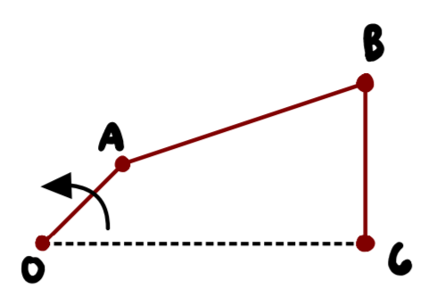
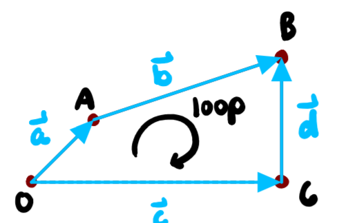
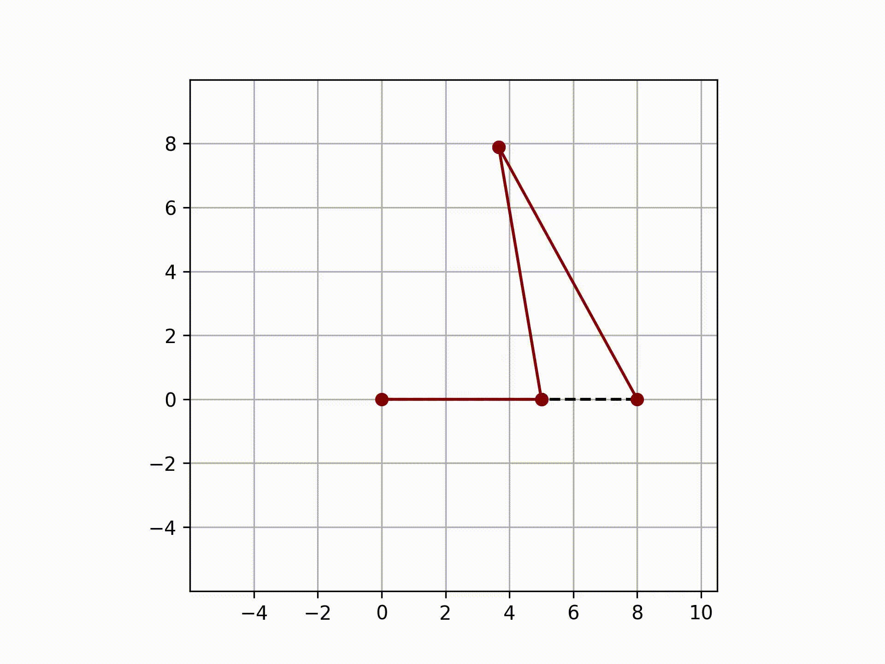
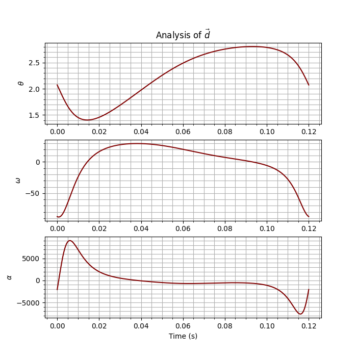
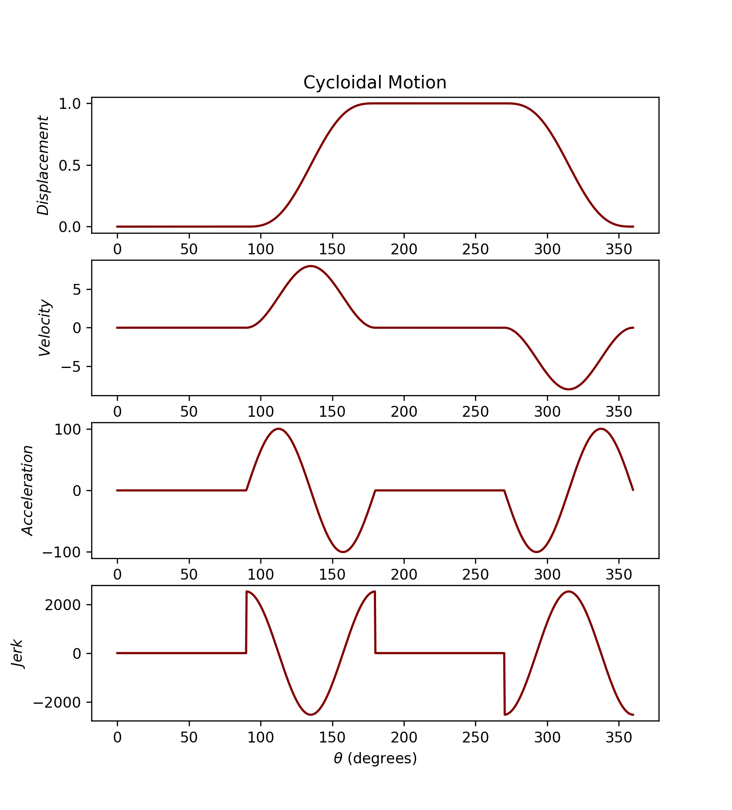
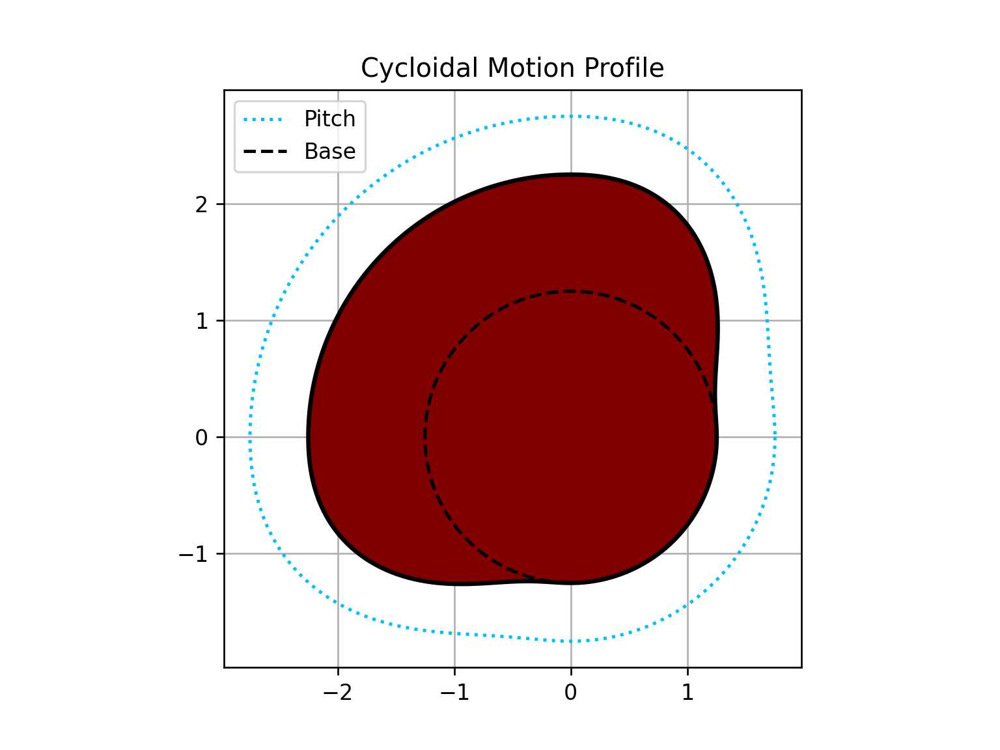
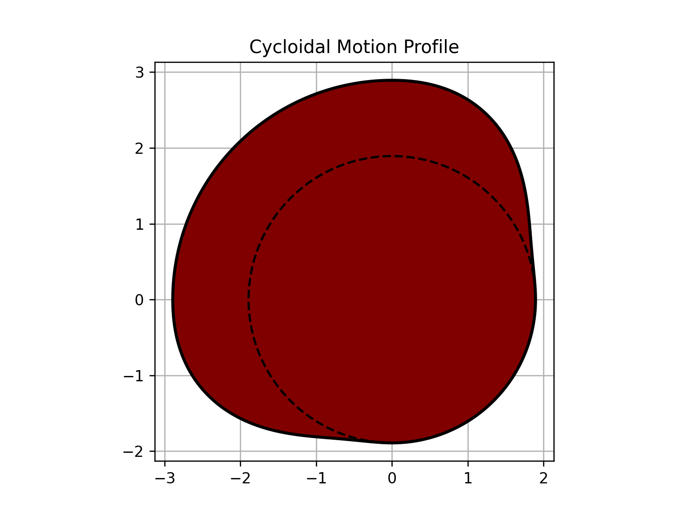
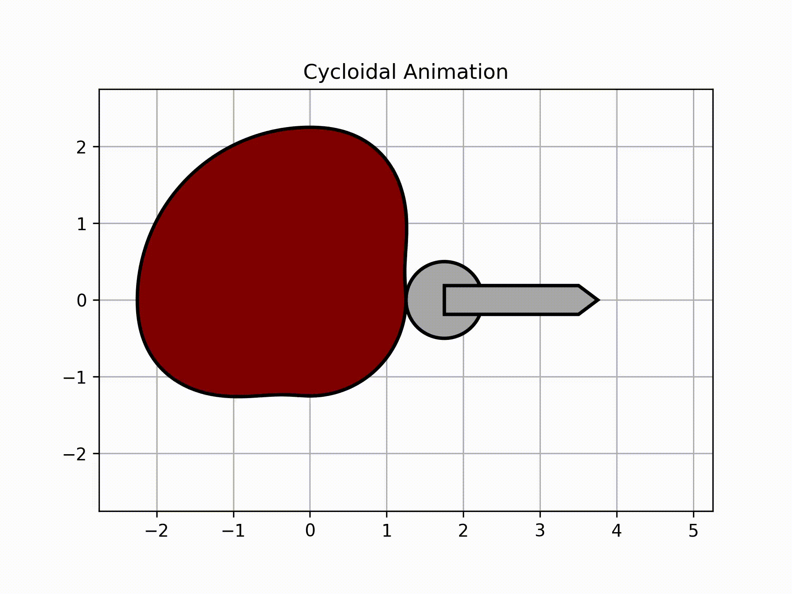
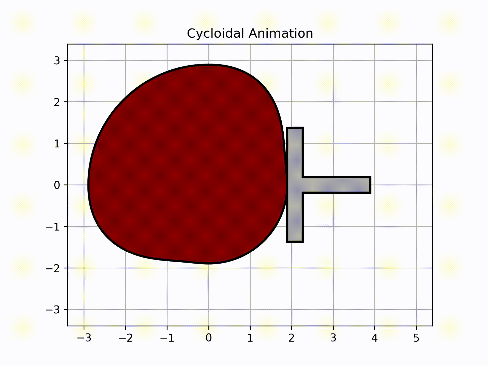
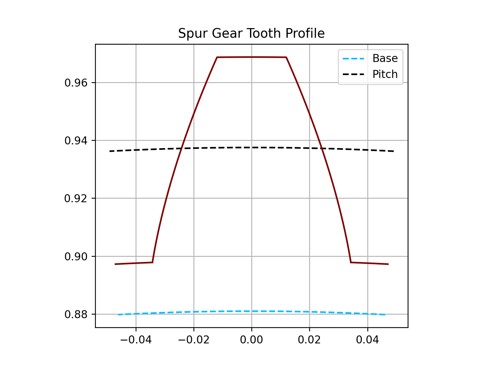

# Macanism

> For those who are suffering about IK...

## Purpose and Overview

This package is being developed to assist in designing mechanisms involving linkages, cams, and gears. The goal is to provide robust tools for kinematic and dynamic analysis.

**For linkages:** The aim is to perform kinematic analysis by utilizing the degrees of freedom for the vectors that define the mechanism. Through numerical solving and iteration, the position, velocity, and acceleration of these vectors and points can be determined.

**For cams:** The package intends to provide the ability to generate cam profile coordinates, plot SVAJ (displacement, velocity, acceleration, and jerk) diagrams, and create animations for cams with roller or flat-faced followers. These coordinates could be used for machining or imported into CAD software like SolidWorks. Users would specify the motion description (e.g., "rise 2 inches in 1 second, dwell for 1.5 seconds, fall 2 inches in 3 seconds"). Supported motion types will include uniform motion, harmonic motion, and cycloidal motion, with plans to introduce improved options like modified sinusoidal motion.

**For gears:** The package aims to generate the coordinates of a spur gear tooth profile based on given properties such as diametral pitch, number of teeth, or pitch diameter. If desired, an argument could be set to apply AGMA standards.

*(The detailed examples below showcase the types of functionalities envisioned for the Macanism project, based on concepts from a predecessor project.)*

## Features

*   Core `MacanismEngine` for basic operations (currently implemented).
*   Planned support for detailed linkage, cam, and gear design and analysis.
*   Built with Python 3.9+
*   Uses Pydantic for data validation.
*   Managed with `uv` and `hatchling`.
*   Clear and extensible object-oriented design.

## Project Structure

```
macanism/
├── src/
│   └── macanism/
│       ├── __init__.py
│       ├── main.py
│       └── macanism_engine.py
│       # (Future modules: linkages.py, cams.py, gears.py, vectors.py, etc.)
├── examples/
│   └── basic_engine_demo.py
│   # (Future examples for linkages, cams, gears)
├── tests/
│   ├── __init__.py
│   └── test_macanism_engine.py
├── docs/
│   ├── conf.py
│   ├── index.rst
│   └── ... (Sphinx documentation)
├── .gitignore
├── CHANGELOG.md
├── LICENSE
├── pyproject.toml
└── README.md
```

## Setup and Installation

### Prerequisites

*   Python 3.9+
*   [uv](https://github.com/astral-sh/uv) (Python package installer and resolver, recommended) or `pip`.

### Installation Steps

1.  **Clone the repository:**
    ```bash
    git clone <your_repository_url> # Update with your repository URL
    cd macanism
    ```

2.  **Create and activate a virtual environment (recommended):**
    ```bash
    python -m venv .venv
    source .venv/bin/activate  # On Windows use `.venv\Scripts\activate`
    ```

3.  **Install dependencies:**
    *   Using `uv` (recommended):
        ```bash
        uv pip install -e .[dev,docs]
        ```
    *   Using `pip`:
        ```bash
        pip install -e .[dev,docs]
        ```
    This installs the project in editable mode (`-e .`) along with its development (`dev`) and documentation (`docs`) dependencies.

## Usage

To run the basic Macanism engine demonstration (once `examples/basic_engine_demo.py` is created):
```bash
python examples/basic_engine_demo.py
```
Or to run the current main application entry point:
```bash
python src/macanism/main.py
```
(More specific usage instructions will be added as the project develops.)

## Tutorials

To effectively use these tools, it is necessary to have some understanding of free body diagrams and vector loops that define a mechanism.
*(The following tutorials are from a related project and demonstrate concepts applicable to mechanism design. Links may point to external content related to the original "macanism" project).*

*   **Introduction to mechanisms with Python:** [Watch Video](https://www.youtube.com/watch?v=kMmYv8u8824&list=PLghzFAspn1-eGjPOTT0D_6LXWqMBFRVIW) (Illustrates basic four-bar linkage concepts)
*   **Advanced mechanisms with Python:** [Watch Video](https://www.youtube.com/watch?v=usY-oBifcM4&list=PLghzFAspn1-eGjPOTT0D_6LXWqMBFRVIW) (Covers more complex examples)

## Examples of Envisioned Capabilities

The following examples illustrate the types of analyses and designs the Macanism project aims to support.
*(Note: The classes like `Vector`, `Joint`, `Cam`, `SpurGear` and specific methods shown below are planned features and may not yet be implemented in the current version of `macanism`. The image links point to resources from the original "macanism" project and may be broken or outdated.)*

### Linkages, Cranks, Couplers, and Rockers

To use the macanism design tools, a basic knowledge of vector loops will be necessary. The structure of the vector loops function is shown in several files under the `examples` folder (to be created).

#### Four Bar Linkage Example



A four-bar linkage is a fundamental mechanism. Its degrees of freedom (DOF) can be determined using Kutzbach's equation:
`DOF = 3*(L-1) - 2*J1 - J2`, where L is the number of links, J1 is the number of full joints (revolute), and J2 is the number of half joints. For a typical four-bar linkage with 4 links and 4 full joints, DOF = 3(4-1) - 2(4) = 1. This means one input is needed to define the system's state.



**Problem Statement:**
Consider a four-bar linkage with link lengths a=5", b=8", c=8" (ground), and d=9". Crank 'a' rotates at 500 RPM. Animate the linkage and plot angle, angular velocity, and angular acceleration of vector 'd'.

**Expected Output (Conceptual):**
Animation:

Plots:



### Cams

Key principle: The jerk function must be finite across the entire interval (360 degrees) for smooth operation. Cycloidal motion often achieves this.

**Problem Statement:**
Design a cam with cycloidal motion: Dwell (0 deg, 90 deg duration), Rise (1 inch, 90 deg duration), Dwell (90 deg duration), Fall (1 inch, 90 deg duration). Cam angular velocity: 2*pi rad/s. Show SVAJ, profile. Size for roller follower (1/2" radius, max pressure angle 30 deg) and flat-faced follower.

**Conceptual Solution Structure:**

```python
# Note: The following code is illustrative of planned features.
# from macanism import Cam # Conceptual import
import numpy as np
import matplotlib.pyplot as plt

# # Cam definition
# # cam_motion = [
# #     ('Dwell', 90),
# #     ('Rise', 1, 90), # Rise 1 inch in 90 degrees
# #     ('Dwell', 90),
# #     ('Fall', 1, 90)  # Fall 1 inch in 90 degrees
# # ]
# # my_cam = Cam(motion=cam_motion, degrees=True, omega=2*np.pi)

# # Plot SVAJ diagrams
# # fig_svaj, ax_svaj = my_cam.svaj(kind='cycloidal')
# # plt.show()

# # Roller follower analysis
# # roller_params = my_cam.get_base_circle(kind='cycloidal', follower='roller', roller_radius=0.5, max_pressure_angle=30, plot=True)
# # Rb_roller = roller_params['Rb']
# # fig_roller_profile, ax_roller_profile = my_cam.profile(kind='cycloidal', base=Rb_roller, show_base=True, roller_radius=0.5, show_pitch=True)
# # plt.show()

# # Flat-faced follower analysis
# # flat_params = my_cam.get_base_circle(kind='cycloidal', follower='flat', desired_min_rho=0.25)
# # Rb_flat = flat_params['Rb']
# # min_face_width = flat_params['Min Face Width']
# # print(f"Flat Follower: Base Radius = {Rb_flat:.3f}", Min Face Width = {min_face_width:.3f}"")
# # fig_flat_profile, ax_flat_profile = my_cam.profile(kind='cycloidal', base=Rb_flat, show_base=True)
# # plt.show()

# # Animations
# # ani_roller, fig_roller_anim, ax_roller_anim, _ = my_cam.get_animation(kind='cycloidal', base=Rb_roller, roller_radius=0.5)
# # ani_flat, fig_flat_anim, ax_flat_anim, _ = my_cam.get_animation(kind='cycloidal', base=Rb_flat, face_width=min_face_width)
# # plt.show()

# # Save coordinates for CAD
# # my_cam.save_coordinates('cam_coordinates.txt', kind='cycloidal', base=Rb_roller, solidworks=True)
```

**Expected Output (Conceptual):**
SVAJ Diagram:

Roller Follower Profile:

Flat Follower Profile:

Animations (GIFs):



### Gears

For involute spur gears, the base circle must generally be below the dedendum circle to avoid undercutting.

**Problem Statement:**
Design a 60-tooth spur gear with a diametral pitch of 32, following AGMA standards.

**Conceptual Solution Structure:**

```python
# Note: The following code is illustrative of planned features.
# from macanism import SpurGear # Conceptual import
import matplotlib.pyplot as plt

# # Gear definition
# # my_gear = SpurGear(N=60, pd=32, agma=True, size=500) # size is point density for profile

# # Plot gear profile
# # fig_gear, ax_gear = my_gear.plot()
# # plt.show()

# # Print gear properties
# # my_gear.rundown()

# # Save coordinates for CAD
# # my_gear.save_coordinates(file='gear_tooth_coordinates.txt', solidworks=True)
```

**Expected Output (Conceptual):**
Gear Profile:

Properties Table (example):
| Property                 | Value    |
|--------------------------|----------|
| Number of Teeth (N)      | 60       |
| Diametral Pitch (pd)     | 32.00000 |
| ...                      | ...      |


## Running Tests

Tests are written using `pytest`. To run the tests:
```bash
pytest
```
Or using hatch:
```bash
hatch run test
```

To generate a coverage report:
```bash
pytest --cov=src/macanism --cov-report=html
```
Or using hatch:
```bash
hatch run cov
```
(Coverage configuration is in `pyproject.toml`)

## Development

### Environment Setup
Follow the [Setup and Installation](#setup-and-installation) steps.

### Coding Style
(Specify coding style, e.g., Black, Flake8, isort, and how to run them. Consider adding these to `pyproject.toml` and pre-commit hooks.)

### Pre-commit Hooks
(Recommended: Set up pre-commit hooks for auto-formatting and linting.)
```bash
# Example: pip install pre-commit
# pre-commit install
```

### Building Documentation
If Sphinx is set up in the `docs` directory:
```bash
cd docs
make html # or sphinx-build -b html . _build
```
Then open `docs/_build/html/index.html` in your browser.

## Reproducibility

(Document all parameters, assumptions, and configurations required to reproduce any experiments or results.)
*   **Environment Setup Script:** See [Setup and Installation](#setup-and-installation). Use `uv pip freeze > requirements.lock.txt` to lock environment.
*   **Running Experiments Script:** (Link to or describe scripts for running experiments, e.g., `python examples/some_experiment.py`)
*   **Reproducing Results:** (Detailed steps or scripts to reproduce published or key results)
*   **Parameters & Configurations:** (List important parameters and configurations. This might be in a separate config file or documented here.)

## Contributing

Contributions are welcome! Please follow these steps:
1. Fork the repository.
2. Create a new branch (`git checkout -b feature/your-feature-name`).
3. Make your changes and add tests.
4. Ensure all tests pass (`hatch run test` or `pytest`).
5. Format and lint your code.
6. Commit your changes (`git commit -m '''Add some feature'''`).
7. Push to the branch (`git push origin feature/your-feature-name`).
8. Open a Pull Request.

Please ensure your code adheres to the project's coding standards.

## License

This project is licensed under the MIT License - see the [LICENSE](LICENSE) file for details.

## Changelog

See [CHANGELOG.md](CHANGELOG.md).

## Contact

Alan Synn - alan@alansynn.com
